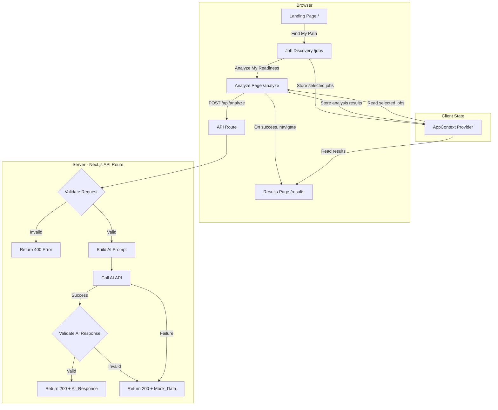

# Design Document — Unlockd Platform

## Overview

Unlockd is an AI-powered career preparation platform built as a Next.js App Router application. It helps students and early-career job seekers bridge the gap between their current skills and the requirements of multiple target roles. The system presents a curated set of 8–12 preloaded job cards on a Job Discovery page, lets users select 2–5 roles, collects their profile text and timeline preference, sends everything to an AI API for analysis, and renders a structured results dashboard with readiness scores, skill analysis, a learning roadmap, course recommendations, project ideas, and resume suggestions.

The MVP uses local component state (no database), Next.js API routes for the backend, and a mock data fallback to ensure the demo works even when the AI API is unavailable.

### Key Design Decisions

1. **Four-page flow with shared context** — The user flow is Landing → Job Discovery → Analyze → Results. Selected jobs and analysis results are carried across pages via a React context provider, avoiding the need for a database or URL-encoded state.
2. **Preloaded job data** — Jobs are defined in `/lib/jobs.ts` as a static array, keeping the MVP simple while providing a realistic browsing experience. No job board API integration is needed.
3. **Single API route** — All analysis logic lives in `POST /api/analyze`, keeping the backend surface minimal.
4. **Fail-safe mock fallback** — If the AI call fails or returns malformed data, the API returns pre-built mock data so the frontend always has valid data to render.
5. **Zod for runtime validation** — Both the API request body and the AI response are validated with Zod schemas, providing type-safe parsing and clear error messages.
6. **Tailwind CSS utility-first styling** — No component library; all styling is done with Tailwind classes for speed and consistency.
7. **`selectedJobs` replaces `jobDescriptions`** — Instead of raw text pasting, the API receives structured `SelectedJob` objects extracted from the preloaded job data, giving the AI richer context (title, company, description, requiredSkills).

## Architecture



### Data Flow

1. User lands on `/` and clicks "Find My Path" to navigate to `/jobs`.
2. On the Job Discovery page, the user browses 8–12 preloaded job cards and selects 2–5 roles. Selections are stored in `AppContext`.
3. User clicks "Analyze My Readiness" to navigate to `/analyze`.
4. On the Analyze page, the user sees a summary of their selected jobs, enters profile text, selects a timeline (2/4/8 weeks), and clicks "Analyze".
5. The frontend POSTs to `/api/analyze` with `{ profile, selectedJobs, timeline }`.
6. The API route validates the request body with Zod. Invalid requests get a 400 response.
7. Valid requests are forwarded to the AI API with a structured prompt containing the profile, selected job details, and timeline.
8. The AI response is parsed and validated against a Zod schema. If validation fails, mock data is returned instead.
9. The frontend receives the response, stores it in `AppContext`, and navigates to `/results`.
10. The Results Dashboard reads from context and renders all dashboard sections.

## Components and Interfaces

### Page Components

| Component | Route | Responsibility |
|---|---|---|
| `LandingPage` | `/` | Hero section, tagline, "Find My Path" CTA → `/jobs` |
| `JobDiscoveryPage` | `/jobs` | Displays preloaded job cards, selection logic, "Analyze My Readiness" → `/analyze` |
| `AnalyzePage` | `/analyze` | Selected jobs summary, profile input, timeline selector, submission, loading state |
| `ResultsPage` | `/results` | Reads context, renders dashboard sections |

### UI Components

| Component | Props | Responsibility |
|---|---|---|
| `LandingHero` | none | Product name, tagline, description, "Find My Path" link to `/jobs` |
| `JobCard` | `job: Job`, `selected: boolean`, `onToggle: () => void`, `disabled?: boolean` | Displays a single job with title, company, location, type, required skills, and a select toggle button |
| `JobGrid` | `jobs: Job[]`, `selectedIds: Set<string>`, `onToggle: (id: string) => void`, `maxReached: boolean` | Grid layout rendering all job cards |
| `SelectionCounter` | `count: number`, `min: number`, `max: number` | Displays "X jobs selected" with min/max context |
| `ProfileInput` | `value: string`, `onChange: (v: string) => void`, `error?: string` | Textarea for profile text |
| `TimelineSelector` | `value: Timeline`, `onChange: (t: Timeline) => void` | Three-option selector (2/4/8 weeks) |
| `SelectedJobsSummary` | `jobs: SelectedJob[]` | Compact list of selected job titles and companies shown on the Analyze page |
| `ResultsDashboard` | `data: AnalysisResult` | Container that renders all result sections |
| `ScoreCard` | `label: string`, `value: number`, `variant?: 'current' \| 'projected'` | Displays a percentage score with visual treatment |
| `SkillList` | `title: string`, `skills: string[]` | Renders a labeled list of skill tags |
| `PrioritySkillCard` | `skill: PrioritySkill` | Displays a single priority skill with all fields |
| `RoadmapTimeline` | `weeks: RoadmapWeek[]` | Week-by-week timeline with tasks and proof-of-work |
| `CourseRecommendations` | `courses: Course[]` | List of course/certification cards |
| `ProjectRecommendations` | `projects: PortfolioProject[]` | List of project idea cards |
| `ResumeSuggestions` | `suggestions: string[]` | Ordered list of actionable resume tips |
| `MentorAdvice` | `advice: string` | Styled block quote for mentor advice text |

### API Interface

**`POST /api/analyze`**

Request body:
```typescript
{
  profile: string;              // non-empty profile text
  selectedJobs: SelectedJob[];  // 2–5 structured job objects
  timeline: "2 weeks" | "4 weeks" | "8 weeks";
}
```

Where each `SelectedJob` contains:
```typescript
{
  title: string;           // job title
  company: string;         // company name
  description: string;     // job description text
  requiredSkills: string[]; // list of required skills
}
```

Success response (200):
```typescript
AnalysisResult // see Data Models
```

Error response (400):
```typescript
{
  error: string; // human-readable validation error
}
```

### Context Provider

```typescript
// AppContext — wraps the app in layout.tsx
interface AppContextValue {
  selectedJobs: SelectedJob[];
  setSelectedJobs: (jobs: SelectedJob[]) => void;
  result: AnalysisResult | null;
  setResult: (r: AnalysisResult) => void;
}
```

## Data Models

All types are defined in `/lib/types.ts` and validated at runtime with Zod schemas.

```typescript
// Job data model — preloaded jobs in /lib/jobs.ts
interface Job {
  id: string;
  title: string;
  company: string;
  location: string;
  type: string;
  description: string;
  requiredSkills: string[];
  preferredSkills: string[];
  category: string;
}

// Subset of Job sent to the API for analysis
interface SelectedJob {
  title: string;
  company: string;
  description: string;
  requiredSkills: string[];
}

type Timeline = "2 weeks" | "4 weeks" | "8 weeks";

interface AnalyzeRequest {
  profile: string;
  selectedJobs: SelectedJob[];
  timeline: Timeline;
}

interface OpportunityCoverage {
  current: string;
  projected: string;
  explanation: string;
}

interface PrioritySkill {
  skill: string;
  priority: "High" | "Medium" | "Low";
  appearsIn: string;
  reason: string;
  recommendedAction: string;
}

interface RoadmapWeek {
  week: string;
  focus: string;
  tasks: string[];
  proofOfWork: string;
}

interface Course {
  name: string;
  type: "Course" | "Certification" | "Practice Resource";
  reason: string;
}

interface PortfolioProject {
  title: string;
  description: string;
  skillsDemonstrated: string[];
}

interface AnalysisResult {
  currentReadiness: number;       // 0–100
  projectedReadiness: number;     // 0–100
  summary: string;
  opportunityCoverage: OpportunityCoverage;
  commonSkills: string[];
  matchedSkills: string[];
  missingSkills: string[];
  prioritySkills: PrioritySkill[];
  learningRoadmap: RoadmapWeek[];
  recommendedCourses: Course[];
  portfolioProjects: PortfolioProject[];
  resumeSuggestions: string[];
  mentorStyleAdvice: string;
}
```

### Zod Schemas

Three Zod schemas are defined in `/lib/types.ts`:

1. **`selectedJobSchema`** — validates a single `SelectedJob` object. Ensures `title` and `description` are non-empty strings, `company` is a string, and `requiredSkills` is an array of strings.
2. **`analyzeRequestSchema`** — validates the incoming API request body. Ensures `profile` is a non-empty string, `selectedJobs` is an array of 2–5 valid `SelectedJob` objects, and `timeline` is one of the three allowed values.
3. **`analysisResultSchema`** — validates the AI API response. Used to determine whether to return the AI result or fall back to mock data. Enforces all required fields, types, and constraints (e.g., `currentReadiness` must be a number between 0 and 100).

## Correctness Properties

*A property is a characteristic or behavior that should hold true across all valid executions of a system — essentially, a formal statement about what the system should do. Properties serve as the bridge between human-readable specifications and machine-verifiable correctness guarantees.*

### Property 1: Valid requests are accepted

*For any* `AnalyzeRequest` with a non-empty `profile` string, 2–5 `selectedJobs` entries (each containing non-empty `title`, `company`, `description`, and a `requiredSkills` string array), and a `timeline` value in `{"2 weeks", "4 weeks", "8 weeks"}`, the `analyzeRequestSchema` SHALL parse successfully and return the original values unchanged.

**Validates: Requirements 7.1**

### Property 2: Invalid requests are rejected

*For any* `AnalyzeRequest` where the `profile` is empty/missing, OR `selectedJobs` has fewer than 2 or more than 5 entries, OR any `selectedJobs` entry is missing a `title` or `description` field, OR `timeline` is not one of the three valid values, the `analyzeRequestSchema` SHALL reject the input with a validation error.

**Validates: Requirements 7.2, 7.3, 7.4, 7.5**

### Property 3: AI response parsing round-trip

*For any* valid `AnalysisResult` object, serializing it to JSON and then parsing it through the `analysisResultSchema` SHALL produce an object equivalent to the original.

**Validates: Requirements 8.2**

### Property 4: Invalid AI response triggers mock data fallback

*For any* JSON value that does not conform to the `AnalysisResult` schema (missing fields, wrong types, out-of-range values), the response validation logic SHALL reject it, and the API route SHALL return mock data that itself passes the `analysisResultSchema` validation.

**Validates: Requirements 9.1, 9.2, 20.2**

### Property 5: AI response schema completeness

*For any* valid `AnalysisResult` object with one required top-level field removed, the `analysisResultSchema` SHALL reject the input.

**Validates: Requirements 20.1**

### Property 6: Readiness score range enforcement

*For any* numeric value outside the range [0, 100], an `AnalysisResult` object containing that value as `currentReadiness` or `projectedReadiness` SHALL be rejected by the `analysisResultSchema`.

**Validates: Requirements 20.3**

### Property 7: Job selection enforces 2–5 bounds

*For any* set of job toggle actions on the Job Discovery page, the number of selected jobs SHALL never be fewer than 0 or exceed 5, and the "Analyze My Readiness" button SHALL be enabled only when the selection count is between 2 and 5 inclusive.

**Validates: Requirements 3.6, 3.7, 3.8, 3.9**

### Property 8: Selection counter accuracy

*For any* sequence of select/deselect actions on job cards, the Selection_Counter display value SHALL equal the actual number of currently selected jobs.

**Validates: Requirements 3.5**

### Property 9: Priority skills are ordered by priority level

*For any* array of `PrioritySkill` objects with mixed priority levels, the rendered output SHALL display High-priority items before Medium-priority items, and Medium-priority items before Low-priority items.

**Validates: Requirements 13.3**

### Property 10: Dashboard components render all data fields

*For any* `Job`, `PrioritySkill`, `RoadmapWeek`, `Course`, or `PortfolioProject` object, the corresponding UI component's rendered output SHALL contain all fields defined in the data model (e.g., a `Job` card renders `title`, `company`, `location`, `type`, and `requiredSkills`; a `PrioritySkill` renders `skill`, `priority`, `appearsIn`, `reason`, and `recommendedAction`; a `RoadmapWeek` renders `week`, `focus`, `tasks`, and `proofOfWork`; a `Course` renders `name`, `type`, and `reason`; a `PortfolioProject` renders `title`, `description`, and `skillsDemonstrated`).

**Validates: Requirements 3.2, 13.2, 14.2, 15.2, 16.2**

## Error Handling

### Frontend Error Handling

| Scenario | Behavior |
|---|---|
| Empty profile text on submit | Display inline validation error, prevent submission |
| Fewer than 2 jobs selected on Job Discovery page | Disable "Analyze My Readiness" button |
| Attempt to select more than 5 jobs | Prevent selection, display max-reached message |
| API returns 400 | Display error message from response body, re-enable Analyze button |
| API returns 500 or network error | Display generic error message ("Something went wrong. Please try again."), re-enable Analyze button |
| Navigation to `/results` without analysis data in context | Redirect to `/analyze` with a message prompting the user to run an analysis first |
| Navigation to `/analyze` without selected jobs in context | Redirect to `/jobs` with a message prompting the user to select jobs first |

### Backend Error Handling

| Scenario | Behavior |
|---|---|
| Request body fails Zod validation | Return HTTP 400 with `{ error: "<specific validation message>" }` |
| AI API call throws (network error, timeout) | Log the error, return HTTP 200 with mock data |
| AI API returns non-200 status | Log the status, return HTTP 200 with mock data |
| AI API response fails Zod validation | Log the validation errors, return HTTP 200 with mock data |
| Unexpected server error | Return HTTP 500 with `{ error: "Internal server error" }` |

### Design Rationale for Mock Fallback

The mock fallback returns HTTP 200 (not an error status) because the frontend should treat mock data identically to real AI data. This keeps the demo functional and avoids error UI when the AI is simply unavailable. The API logs the actual failure for debugging.

## Testing Strategy

### Unit Tests (Example-Based)

Unit tests cover specific UI behaviors, rendering, and integration points:

- **Landing Page**: Verify product name, tagline, "Find My Path" CTA presence and navigation to `/jobs`
- **Job Discovery Page**: Verify job cards render from `/lib/jobs.ts`, select/deselect toggles work, selection counter updates, min/max enforcement, "Analyze My Readiness" button enable/disable logic, ARIA selection state attributes
- **Job Card**: Verify individual card renders all job fields, select toggle visual state
- **Selection Counter**: Verify display matches selection count
- **Analyze Page**: Verify selected jobs summary display, profile input, timeline selector, validation messages, loading state, error display, ARIA live region
- **Timeline Selector**: Verify three options, default 4-week selection
- **Results Dashboard**: Verify all sections render with mock data, semantic heading hierarchy
- **Individual Result Components**: Verify each component renders with sample data
- **API Route**: Verify 400 responses for invalid inputs (missing profile, invalid selectedJobs count, missing title/description in selectedJobs, invalid timeline), 200 for valid inputs, mock fallback on AI failure
- **Accessibility**: Verify label associations, heading hierarchy, ARIA attributes on job cards and loading states
- **Mock Data**: Smoke test that mock data passes the `AnalysisResult` schema
- **Context Provider**: Verify selected jobs and results persist across route transitions

### Property-Based Tests

Property-based tests verify universal correctness properties using [fast-check](https://github.com/dubzzz/fast-check) (the standard PBT library for TypeScript/JavaScript).

Each property test runs a minimum of 100 iterations with randomly generated inputs.

| Property | What It Tests | Tag |
|---|---|---|
| Property 1 | Valid AnalyzeRequest objects with selectedJobs pass schema validation | Feature: unlockd-platform, Property 1: Valid requests are accepted |
| Property 2 | Invalid AnalyzeRequest objects (bad profile, selectedJobs count, missing fields, bad timeline) are rejected | Feature: unlockd-platform, Property 2: Invalid requests are rejected |
| Property 3 | AnalysisResult round-trip through JSON serialization | Feature: unlockd-platform, Property 3: AI response parsing round-trip |
| Property 4 | Malformed AI responses trigger mock data fallback that passes schema | Feature: unlockd-platform, Property 4: Invalid AI response triggers mock data fallback |
| Property 5 | Removing any required field from AnalysisResult causes rejection | Feature: unlockd-platform, Property 5: AI response schema completeness |
| Property 6 | Out-of-range readiness scores are rejected | Feature: unlockd-platform, Property 6: Readiness score range enforcement |
| Property 7 | Job selection logic enforces 2–5 bounds | Feature: unlockd-platform, Property 7: Job selection enforces 2–5 bounds |
| Property 8 | Selection counter always matches actual selection count | Feature: unlockd-platform, Property 8: Selection counter accuracy |
| Property 9 | Priority skills render in High > Medium > Low order | Feature: unlockd-platform, Property 9: Priority skills ordered by priority level |
| Property 10 | Dashboard components render all fields for any valid data (JobCard, PrioritySkill, RoadmapWeek, Course, PortfolioProject) | Feature: unlockd-platform, Property 10: Dashboard components render all data fields |

### Test Configuration

- **Framework**: Jest or Vitest (compatible with Next.js)
- **PBT Library**: fast-check
- **Minimum PBT iterations**: 100 per property
- **Component testing**: React Testing Library for rendering and DOM assertions
- **Coverage targets**: All API validation paths, all dashboard component rendering paths, job selection logic
